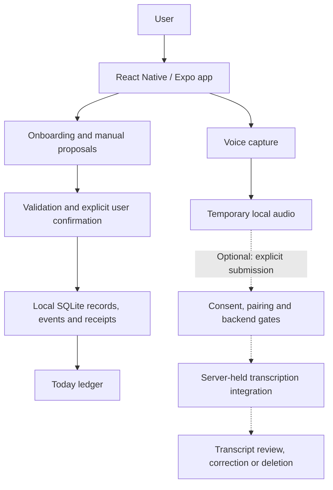

# Forge the Day

> A mobile accountability prototype designed around voice check-ins, explicit commitments, and privacy-conscious interaction.

**Independent project by Damiyen Lane · React Native / Expo · TypeScript · SQLite**

**Status:** unfinished private prototype. This public repository is a documentation case study, not the application or an installable demo.

## Overview

Goals often become disconnected from daily actions. Voice makes capture easier, but something said aloud is not necessarily a promise—and a transcript is not a plan.

I developed Forge the Day from an early concept into a mobile prototype with resumable onboarding, a persisted Today ledger, explicit confirmation, temporary voice capture, and gated transcription. The intended voice-to-commitment experience is incomplete: users currently create proposals manually; recordings and transcripts do not generate them.

## Product approach

- **Separate possibility from commitment.** Saving a proposal does not commit the user. Confirmation is a distinct, validated action.
- **Make capacity visible.** Today permits up to three confirmed primary commitments; replacing one requires an explicit choice.
- **Keep local state durable.** Onboarding drafts, confirmed records, and change history persist in SQLite.
- **Treat voice as temporary input.** Recording has bounded duration, playback, cancellation, deletion, and interruption handling.
- **Make remote processing explicit.** Optional transcription requires consent, device pairing, and server controls. Current development launch profiles select local capture without provider calls.

## Architecture

There is no implemented transcript-to-proposal connection. The dotted path is excluded from the current provider-free launch configuration. [Architecture and evidence](docs/architecture.md) explains the boundaries and platform limits.

## Engineering highlights

### Confirmation is enforced below the UI

Typed commands and runtime schemas separate drafts, proposals, and commitments. The ledger rejects unauthorized confirmation and changes to reviewed meaning. Generic updates cannot bypass that boundary.

### Persistence covers recovery, not just saving

State, change events, and retry receipts commit together. Migrations, revision checks, and idempotent operations address partial writes, stale edits, restart, and repeated taps. SQLite and in-memory adapters share contract tests.

### Recording interruption recovery

Android could pause the native recorder before the app received its background event. A conditional stop skipped finalization, allowing recording to resume while the UI said it was interrupted. The correction handles that paused state; regression and historical device checks cover file stability, microphone shutdown, and deletion. [Engineering example](docs/engineering-example.md).

### Privacy boundaries shape the implementation

Local capture and remote transcription are separate paths. Credentials stay behind the backend; consent and pairing precede submission. Transcript review cannot confirm a commitment. These prototype controls do not establish production security or compliance.

## Reliability and testing

The latest private main-branch CI run, September 12, 2026, passed dependency, formatting, lint, strict TypeScript, application/backend test, configuration, Expo Doctor, Android export, and backend dry-run checks. Tests cover migrations, rollback, retries, confirmation authority, and audio state transitions.

A September Android development-build run covered installation, synthetic-state preservation, permission recovery, recording cleanup, backgrounding, and screen lock. That binary preceded the final dependency patch refresh. Earlier iOS/TestFlight packaging is also historical; current SDK 57 iPhone behavior and external acceptance remain incomplete. Device/provider scenarios were not rerun for this publication.

## Technology

React Native 0.86.3 · Expo SDK 57 · Expo Router · TypeScript · Expo SQLite · Zod · Expo Audio · Jest / React Native Testing Library · GitHub Actions. The optional transcription backend uses a Cloudflare Worker with D1, R2, and queues.

## Current status and boundaries

Forge the Day is not finished, production-ready, or publicly distributed. Core local mobile flows and voice foundations are implemented, with automated tests and bounded historical Android evidence. Voice-to-proposal processing, coaching, evening/weekly reviews, dashboards, notifications, accounts, and cloud synchronization remain outside the implemented product. Current iOS validation, remaining Android interruption/accessibility scenarios, TestFlight update preservation, and the next external acceptance round remain open. Local records are not application-encrypted; dependency findings remain unresolved.

## What I learned

- User input and confirmed intent need different types, actions, and storage rules.
- Mobile audio correctness depends on native lifecycle state as well as visible UI state.
- Atomic changes and retry receipts make persistence a recovery mechanism.
- Tests should exercise interrupted transitions and failure paths, not only completed flows.
- Documentation needs reconciliation with code and merged history as a project evolves.

## Private source note

The application source repository is private. This case study contains newly written, sanitized documentation and selected evidence summaries. Credentials, private build information, recordings, user data, internal configuration, and unpublished product material are intentionally excluded.

AI-assisted development was part of the workflow; this case study focuses on the product decisions, implementation, debugging, and validation.
