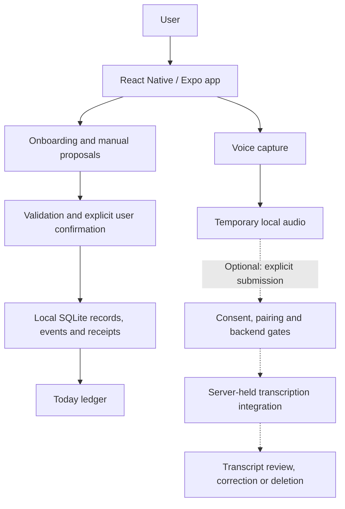

# Architecture and evidence

Audited September 29, 2026 against private source, Git history, tests, and CI. The [system diagram](#system-overview) shows local flows and optional transcription. This documentation repository is not a runnable demo; private implementation/test claims cannot be reproduced from it alone.

## System overview

There is no implemented transcript-to-proposal connection. The dotted path is excluded from the current provider-free launch configuration. The sections below explain the boundaries and platform limits.

## Product approach

- **Separate possibility from commitment.** Saving a proposal does not commit the user. Confirmation is a distinct, validated action.
- **Make capacity visible.** Today permits up to three confirmed primary commitments; replacing one requires an explicit choice.
- **Keep local state durable.** Onboarding drafts, confirmed records, and change history persist in SQLite.
- **Treat voice as temporary input.** Recording has bounded duration, playback, cancellation, deletion, and interruption handling.
- **Make remote processing explicit.** Optional transcription requires consent, device pairing, and server controls. Current development launch profiles select local capture without provider calls.

## Boundaries in the mobile application

**Presentation:** Expo Router composes onboarding, Today, proposals, commitment detail, and voice capture. Screens call services rather than issuing SQL.

**Domain and application:** Framework-independent rules define valid states, authority, dates, and capacity. Schemas validate commands and stored records. Proposals require user confirmation; transcripts remain separate captures.

**Persistence:** Typed ports isolate SQLite. Records, append-oriented events, and receipts commit together. Receipts prevent duplicate retries; revisions reject stale edits. Four forward migrations cover domain records/events, onboarding drafts, commitment operations, and transcription. This record/event store is not full event sourcing.

**Platform:** Expo Audio/FileSystem handle recording and temporary files; startup recovery removes tracked orphaned audio. Session material uses SecureStore. Raw audio and tokens do not enter domain SQLite. Product records and retained transcripts are not application-encrypted.

## Local capture versus remote transcription

Development scripts and configured build profiles select the provider-free runtime. Its voice route excludes the remote-transcription controller. This proves configured behavior, not current hosted-service health.

The remote path requires consent, pairing, and explicit submission of completed audio. The backend manages bounded jobs with server-held credentials. Calls require all approval flags and a credential; committed configuration keeps the flags closed.

Transcripts can be reviewed, corrected, or deleted; they cannot generate commitments. Historical closed-prototype runs covered upload, transcription, acknowledgement, and cleanup. They do not establish universal deletion, public-user confidentiality, compliance, or current hosted health.

## Evidence by scope

| Claim | Evidence inspected | What remains open |
| --- | --- | --- |
| Onboarding and Today are implemented | Current routes/services; schema and repository tests; historical Android scenario records | No claim of a completed daily accountability loop |
| Local data survives restart and valid upgrades | Migration/reopen, rollback, corrupt-record and idempotency tests; historical synthetic Android restart/update run | No cloud recovery; Android development-package update is not a TestFlight update |
| Confirmation cannot be silently bypassed | Ledger tests reject provider actors, altered reviewed meaning, and generic commitment transitions | Automated voice interpretation is not implemented |
| Current source passes its automated pipeline | Latest main CI, September 12: full validation successful; 24 application suites / 185 tests, 14 Worker tests, Expo Doctor 21/21 | Observed CI record, not a new local run, native build, device run, or acceptance decision |
| Android recording background fix has device evidence | September development APK: stable finalized file, microphone inactive, interruption shown, deletion completed; focused regression test | Binary predates the final Expo patch refresh; no new device run for this case study |
| Remote transcription exists | Current client/backend source and tests; earlier closed-prototype hosted/device lifecycle records | Not enabled in current provider-free launch profiles; no fresh hosted/provider inspection |
| iOS distribution was prepared historically | Repository records a signed SDK 54 package, upload and private TestFlight beta approval in early September | No accepted physical SDK 54 baseline; current SDK 57 iOS native/device and two-build TestFlight preservation evidence remain open |
| Later external validation is incomplete | Current acceptance and platform handoff records | No inferred installation, independent acceptance, or product-market validation |

Source and CI were checked live. Device, provider, and Apple outcomes are historical records, not fresh reruns.

## Conflicting documentation and failed evidence

Private README/instruction text still calls the SDK migration or Android correction unmerged; live GitHub confirms both merged. Older architecture text defers transcription, while current code and later records establish its bounded implementation. Extraction/coaching remains unfinished.

An intermediate CI failure exposed Expo patch compatibility drift. A later patch refresh and successful CI supersede it. The earlier device binary retains its original provenance.

The scripted transcription evaluation failed quality thresholds. Later owner-supplied review reported speech/script differences and accepted actual-speech transcription for the closed prototype. Neither record is rewritten; no benchmark accuracy claim is made.

The last dependency review has unresolved moderate/high tooling findings. No clean security audit, waiver, or current vulnerability count is claimed.

## Presentation choices

Inspected app screenshots contain overlays and an earlier UI; design references include planned screens. They are excluded. The newly authored diagram depicts implemented boundaries.

## Validation snapshot

The latest private main-branch CI run, September 12, 2026, passed dependency, formatting, lint, strict TypeScript, application/backend test, configuration, Expo Doctor, Android export, and backend dry-run checks. Tests cover migrations, rollback, retries, confirmation authority, and audio state transitions.

A September Android development-build run covered installation, synthetic-state preservation, permission recovery, recording cleanup, backgrounding, and screen lock. That binary preceded the final dependency patch refresh. Earlier iOS/TestFlight packaging is also historical; current SDK 57 iPhone behavior and external acceptance remain incomplete. Device/provider scenarios were not rerun for this publication.

## Technology

React Native 0.86.3 · Expo SDK 57 · Expo Router · TypeScript · Expo SQLite · Zod · Expo Audio · Jest / React Native Testing Library · GitHub Actions. The optional transcription backend uses a Cloudflare Worker with D1, R2, and queues.

## Remaining product and validation work

Forge the Day is not finished, production-ready, or publicly distributed. Core local mobile flows and voice foundations are implemented, with automated tests and bounded historical Android evidence. Voice-to-proposal processing, coaching, evening/weekly reviews, dashboards, notifications, accounts, and cloud synchronization remain outside the implemented product. Current iOS validation, remaining Android interruption/accessibility scenarios, TestFlight update preservation, and the next external acceptance round remain open. Local records are not application-encrypted; dependency findings remain unresolved.

AI-assisted development was part of the workflow. This case study focuses on product decisions, implementation, debugging, and validation.
